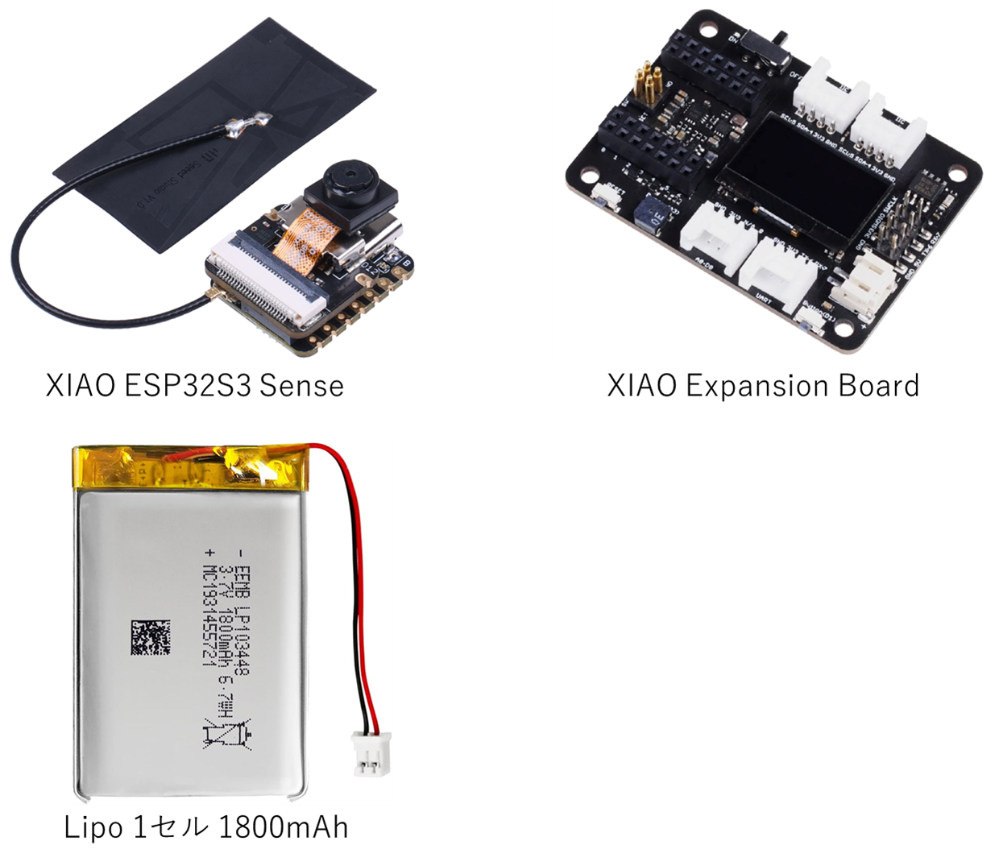

# 音声記録デバイス 仕様書

**作成者：東京科学大学 添田悠介**
**作成日：2025年12月24日**

## 1. 概要
本デバイスは、周辺音声をリアルタイムまたは間欠的に取得し、無線ネットワークを介して他のデバイスへ転送することを目的としたモバイル音声レコーダーである。カードサイズの筐体に、音声入力と通信機能を搭載している。

---

## 2. 製品仕様

### 2.1 形状・寸法

本デバイスの物理的なサイズ、重量、および筐体の材質についての仕様は以下の通りである。プロトタイプとしての即時検証性と拡張性を優先し、携行性のあるカードサイズを採用した

| 項目 | 仕様 | 備考 |
| :--- | :--- | :--- |
| **外形寸法** | 約 W58 × D43 × H20 mm | クレジットカードサイズ相当|
| **重量** | 約60g | MCU, 拡張ボード, バッテリー, PLAケースの合計 |
| **筐体素材** | PLA | バッテリーを保護する |

### 2.2 主要機能

デバイスが備える音声取得、データ転送、および電源に関する技術仕様を以下に示す。耐ノイズ性に優れた音声サンプリングと安定性の高い無線通信を両立している。

| 項目 | 仕様 | 備考 |
| :--- | :--- | :--- |
| **音声取得方式** | PDMマイク | |
| **無線通信方式** | Wi-Fi | 2.4GHz帯対応 |
| **電源方式** | リチウムポリマーバッテリー | USB Type-C充電対応, 保護回路を統合 |
---

## 3. インターフェース
外部との接続や操作を行うための物理的なポート、およびスイッチの構成は以下の通りである。
* **USB Port:** 充電およびファームウェア書き換え用（Type-C）
* **物理スイッチ:** イベントトリガー用物理スイッチ

## 4. 構成部品リスト

本デバイスを組み立てるために必要な主要部品のリストを以下にまとめる。メインマイコンを中心に、拡張性の高いモジュール構成となっている。

| 部品名 | 役割 | 備考 |
| :--- | :--- | :--- |
| Seeed Studio XIAO ESP32S3 Sense | メインマイコン & マイク | デジタルマイク、WiFi/BLEモジュール搭載 |
| Seeed Studio XIAO Expansion Board | インターフェース拡張 | バッテリー充電回路、スイッチ等 |
| LiPo 1S Battery | 電源供給 | 3.7V、1800mAh |
| PLAカバー | 外装 | バッテリーを保護する |

    

（出典：スイッチサイエンス）

## 5. 他の余剰インターフェース

Seeed Studio XIAO ESP32S3 SenseおよびXIAO Expansion Boardには、本プロジェクトで利用する基本機能以外にも、拡張に利用可能な以下のインターフェースが備わっている。

| インターフェース | 型番 | 備考 |
| :--- | :--- | :--- |
| カメラ | OV2640 | 解像度 1600×1200 |
| microSDカードスロット | - | 最大32GB対応 |
| LED インジケータ | - | オレンジ色 |
| OLEDディスプレイ | SSD1306 | 0.96インチ 解像度 128×64 |
| RTCモジュール | PCF8563 | CR1220が必要 |
| パッシブブザー | - | - |
| Groveコネクタ| - |I2C, UART, ADC, Digital対応 |