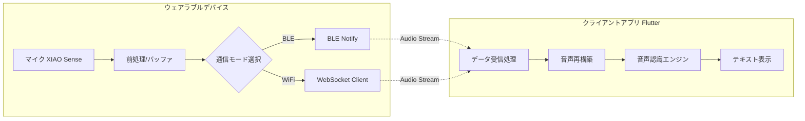

# 音声認識AIデバイス システム仕様書

**Version:** 1.0.0  
**Date:** 2025-12-21  
**Author:** [Your Name/Organization]

---

## 1. システム概要

本システムは、ウェアラブルデバイス（ESP32S3）にて取得した音声を無線（WiFi または BLE）で送信し、クライアントアプリ（スマートフォン/PC）にて受信、音声認識（STT: Speech to Text）を行いテキスト化するシステムである。

### 1.1 全体構成図



---

## 2. ハードウェア仕様

### 2.1 構成部品

| 部品名 | 役割 | 備考 |
|--------|------|------|
| Seeed Studio XIAO ESP32S3 Sense | メインマイコン & マイク | デジタルマイク、WiFi/BLEモジュール搭載 |
| Seeed Studio XIAO Expansion Board | インターフェース拡張 | バッテリー充電回路、スイッチ等 |
| Lipo 1S Battery | 電源供給 | 3.7V、容量は筐体サイズに依存 |

### 2.2 ピンアサイン・リソース

- **Audio Input:** I2S0 (XIAO Senseオンボードマイク)
- **Status LED:** GPIO 21 (User LED) - 通信状態表示用
- **Mode Switch:** Expansion Board上のボタンを割り当て（例: GPIO 1）
  - 起動時の長押しでWiFi/BLE切り替え、または自動フォールバック

---

## 3. デバイス側ファームウェア仕様

### 3.1 音声データフォーマット

- **サンプリングレート:** 16,000 Hz (16kHz)
- **ビット深度:** 16-bit PCM
- **チャンネル:** Mono

**圧縮 (推奨):**
- WiFi時: Raw PCM（帯域十分のため非圧縮）
- BLE時: ADPCM (4bit) または Opus (ESP-ADF利用)
  - ※初期実装では簡易化のためBLEもRaw PCMで試し、途切れる場合はADPCMを導入

### 3.2 通信モード仕様

#### A. BLEモード (Low Power)

- **Role:** Peripheral
- **Service UUID:** `12345678-1234-5678-1234-56789abcdef0`
- **Characteristics:**
  - **Audio Data (Notify):** 音声パケット送信（MTUサイズに合わせて分割、例: 240bytes/packet）
  - **Control (Write/Read):** 録音開始/停止コマンド、サンプリングレート設定など

#### B. WiFiモード (High Speed / Long Range)

- **Role:** Station（スマホのテザリングまたは固定APに接続）
- **Protocol:** WebSocket Client
- **Endpoint:** `ws://[Mobile_IP]:[Port]/audio_stream`
- **動作:** 接続確立後、バイナリフレームとして音声データをストリーム送信

### 3.3 処理フロー

1. **初期化:** I2S初期化、設定読み込み
2. **接続待機:** 指定されたモード(BLE/WiFi)で待機
3. **録音ループ:**
   - DMAバッファからPCMデータ取得
   - （必要に応じて）ゲイン調整 / ノイズフィルタ
   - パケット分割
   - 無線送信（Send Queueへプッシュ）

---

## 4. ソフトウェア側仕様 (Client Application)

### 4.1 開発環境・技術スタック

- **Framework:** Flutter (Dart)
- **Target OS:** Android, iOS, Windows, macOS
- **主要ライブラリ:**
  - **BLE:** flutter_blue_plus
  - **WiFi/Socket:** web_socket_channel
  - **Audio:** sound_stream or just_audio
  - **Permission:** permission_handler

### 4.2 音声認識 (STT) アーキテクチャ

STTプロバイダを抽象化してインターフェース化（SttService）

#### Online API（高精度）
- OpenAI Whisper API / Google Cloud Speech-to-Text
- **メリット:** 非常に高精度
- **デメリット:** インターネット接続必須、APIコスト

#### On-Device（オフライン/コストゼロ）
- **Mobile:** OS標準API（speech_to_text パッケージ経由）
- **PC/High-spec Mobile:** Whisper.cpp（ローカル推論）

### 4.3 アプリケーション機能要件

#### 画面構成

**接続画面:**
- BLEスキャン & 接続ボタン
- WiFiサーバー起動ボタン（IPアドレス表示）

**モニタリング画面:**
- 接続ステータス表示
- リアルタイム音声波形（オプション）
- 認識テキストログ表示（チャット形式）
- テキストのコピー/保存機能

#### データ処理フロー

1. **受信:** BLE Notify または WebSocket からバイトデータを受信
2. **デコード:** （圧縮している場合）ADPCM等をPCM 16bitに展開
3. **バッファリング:** 音声認識エンジン向けの単位（0.5〜1秒、または無音検知）までバッファリング
4. **認識:** バッファデータをSTTサービスへ投げる
5. **表示:** 返ってきたテキストをUIに追加描画

---

## 5. 開発ロードマップ（推奨手順）

### Phase 1: コア機能実装 (WiFi & PC)

- **Device:** I2Sマイクからの録音とSerial Plotterでの波形確認
- **Device:** WiFi WebSocket Clientの実装
- **App (PC):** Pythonスクリプト等で簡易受信サーバーを作成し、音声保存・再生を確認
- **App (Flutter):** PC向けビルドで受信・再生を実装

### Phase 2: BLE化とモバイル対応

- **Device:** BLE Notifyの実装とスループット測定（16kHz PCMが通るか確認）
- **App:** flutter_blue_plus を導入し、Android/iOS実機で受信テスト

### Phase 3: 音声認識結合

- **App:** 受信データをOpenAI Whisper APIなどに投げてテキスト化する処理を追加
- **App:** UIのブラッシュアップ

### Phase 4: 最適化

- **Device:** 省電力化（Deep Sleep制御）
- **Device/App:** 音声圧縮（ADPCM/Opus）の導入（BLE通信安定化のため）

---

## 6. 通信プロトコル詳細定義

### 6.1 BLE GATT仕様

| Service / Char | UUID | Properties | Description |
|---|---|---|---|
| Audio Service | UUID_SVC | - | 音声転送サービス |
| Audio Data | UUID_DATA | Notify | 音声データ (Max MTU - 3 bytes) |
| Command | UUID_CMD | Read/Write | 0x01: Rec Start, 0x02: Rec Stop |

### 6.2 WebSocket パケット構造

- **音声データ:** Binary Message (Raw PCM)
- **メタデータ:** Text Message (JSON)
  ```json
  {"type": "config", "rate": 16000}
  ```

---

## 補足アドバイス

### 1. BLEでの音声送信の課題

- 16kHz 16bit モノラルの場合、データレートは `16000 × 16 = 256kbps`
- BLEの実行スループットは環境依存だが、安定して出るのは数十〜100kbps程度が多い
- **Phase 4の圧縮（ADPCMなど）は、BLEモード実用化において必須になる可能性が高い**
- まずはWiFiで動作確認することをお勧めします

### 2. Expansion BoardのSDカード

- 通信が途切れた際のバックアップ用として、SDカードへの同時書き込み機能を実装するとデバッグ時に役立ちます

**推奨開始:** 「WiFiでPCに飛ばしてPythonで受ける」あたりからプロトタイピングを始めるとスムーズです。